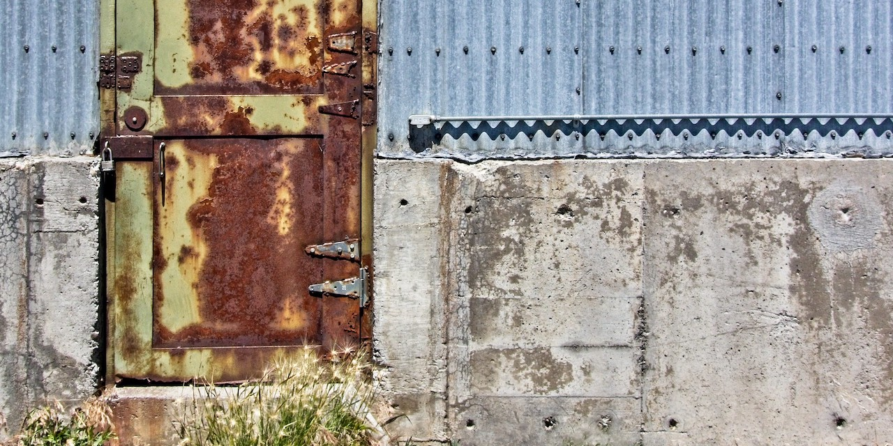

# Rusty Doors


The goal of this crate is to expose the [illumos][1] [Doors API][2] in
Rust. It exposes the native doors API verbatim, and also provides some
moderately safer abstractions.

## Example

A *server procedure* that simply doubles its input might look like this:

```rust
use doors::server::Door;
use doors::server::Request;
use doors::server::Response;

#[doors::server_procedure]
fn double(x: Request<'_>) -> Response<[u8; 1]> {
  if x.data.len() > 0 {
    return Response::new([x.data[0] * 2]);
  } else {
    // We were given nothing, and 2 times nothing is zero...
    return Response::new([0]);
  }
}

let door = Door::create(double).unwrap();
door.force_install("/tmp/double.door").unwrap();
```

A client program which invokes that server procedure might look
something like this:

```rust
use doors::client::Client;

let client = Client::open("/tmp/double.door").unwrap();

let result = client.call_with_data(&[111]).unwrap();
assert_eq!(result.data()[0], 222);
```

## Tests
Run `make tests` to run the unit tests, and run `make all` to run the
full build pipeline.


## Acknowledgements
* The social media preview image is due to [Jim Choate][4] under the
  terms of [CC BY-NC 2.0][5].
* This work preceeds, but was reignited by
  [oxidecomputer/rusty-doors][3].


<!-- REFERENCES -->
[1]: https://illumos.org/
[2]: https://github.com/robertdfrench/revolving-door
[3]: https://github.com/oxidecomputer/rusty-doors
[4]: https://www.flickr.com/photos/jimchoate/50854146398
[5]: https://creativecommons.org/licenses/by-nc/2.0/
