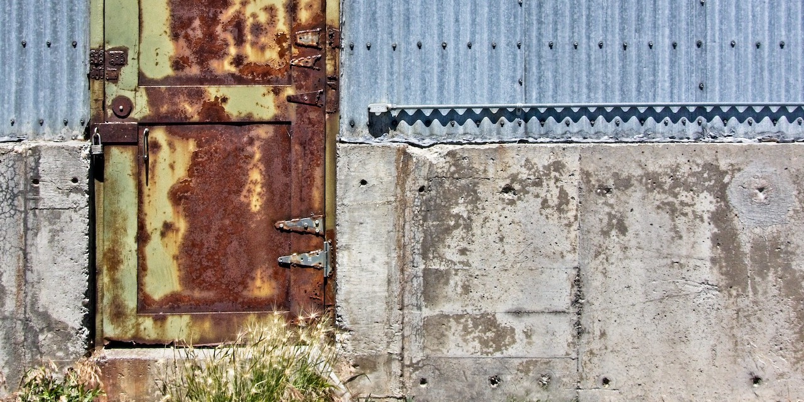

# Rusty Doors


Access the [illumos][1] [Doors API][2] from Rust.

Doors are a fast way for two processes on the same machine to talk. A
client calls a door; the kernel runs a procedure in the server process
on the calling thread's behalf and comes straight back, without giving
up the CPU. When latency matters they beat pipes and UNIX domain
sockets.

## The three crates

| crate | what it is |
|---|---|
| `doors-sys` | The raw C surface. No safety, no ergonomics, no allocation. |
| `door-macros` | The `#[doors::server]` attribute macro. |
| `doors` | The safe API. Depends on both and re-exports the macro. |

Most people want `doors`.

## Calling a door

```rust
use doors::Client;

let client = Client::open("/var/run/my_door")?;
let reply = client.call(b"ping")?;
println!("{}", String::from_utf8_lossy(reply.data()));
```

## Serving a door

Server procedures live on an `impl` block, so they can take `&self` and
reach the state the door was built with.

```rust
use doors::{Door, NoDescriptors, Request};

struct Greeter { greeting: String }

#[doors::server]
impl Greeter {
    #[door(refuse_desc)]
    fn hello(&self, req: Request<'_, NoDescriptors>)
        -> Result<Vec<u8>, std::io::Error>
    {
        let who = String::from_utf8_lossy(req.data());
        Ok(format!("{}, {who}!", self.greeting).into_bytes())
    }
}

let mut door = Door::builder(Greeter { greeting: "hello".into() })
    .thread_stack_size(256 * 1024)
    .build_hello()?;
door.attach("/var/run/my_door")?;
```

The macro generates one `build_<method>()` per annotated method.

## What the types are for

The C interface is fast, but it is easy to use wrongly in ways the
compiler could have caught. These are the mistakes this crate removes
rather than documents:

- **A client cannot send a descriptor to a door that refuses them.**
  `Client<NoDescriptors>` has no method that sends one. Opting in with
  `with_descriptors()` asks the door first, and fails if it was created
  with `DOOR_REFUSE_DESC`.
- **A reply always unmaps.** A large reply arrives in fresh pages the
  caller must `munmap`. `Reply` owns that mapping and releases it on
  `Drop`, and `data()` borrows from it, so a slice cannot outlive it.
- **Nothing leaks through `door_return`.** That call does not return on
  success, so no destructor on the server thread ever runs. The
  generated trampoline drops everything before calling it, and a panic
  is caught and turned into an error the client can read rather than
  unwinding out of an `extern "C"` frame.
- **A forked child cannot tear down its parent's door.** The descriptor
  is inherited, so `door_revoke` in the child looks reasonable and
  quietly breaks the parent. `doors::fork()` handles this, with a
  `pthread_atfork` backstop for forks that go around it.
- **Descriptor ownership is explicit.** `SentFd::Shared` borrows;
  `SentFd::Released` gives the descriptor away, consuming the
  `OwnedFd`, because the kernel closes it on almost every path. On the
  one class of failure where it does not, they come back.

## Building and testing

Doors are an illumos facility, so this crate is illumos only. It does
not build on any other system, and it does not try to.

Everything runs on a disposable illumos VM. `make vm-up` records the
address, so the rest of the targets need no arguments:

```sh
make vm-up          # spin a VM, install rust, remember the address
make test           # rsync the worktree there and run the suite
make test-loop N=20 # the same, N times, to catch flaky failures
make vm-down        # always, pass or fail
```

Nothing is compiled on your own machine. There is no reason to: the
crate does not build anywhere but illumos, and a doors crate that
compiles on a machine with no doors has not told you anything.

`GOALS.md` is the specification and `docs/DESIGN.md` has the reasoning.
`experiments/` holds small C programs used to settle questions the
manual pages do not answer — including three places where the kernel
does not behave the way the documentation suggests.

## A warning about shared libraries

The crate registers `pthread_atfork` handlers, and those can never be
unregistered. If it is linked into a `cdylib` that is later `dlclose`d,
the handler addresses become invalid and the next `fork` in that
process crashes. Link it into an executable. That is the ordinary case
for a door server anyway.

## Acknowledgements
* The social media preview image is due to [Jim Choate][4] under the
  terms of [CC BY-NC 2.0][5].
* This work preceeds, but was reignited by
  [oxidecomputer/rusty-doors][3].


<!-- REFERENCES -->
[1]: https://illumos.org/
[2]: https://illumos.org/man/3C/door_create
[3]: https://github.com/oxidecomputer/rusty-doors
[4]: https://www.flickr.com/photos/jimchoate/50854146398
[5]: https://creativecommons.org/licenses/by-nc/2.0/
